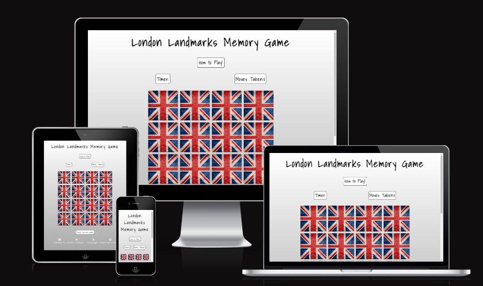
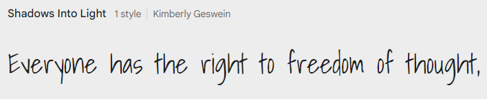
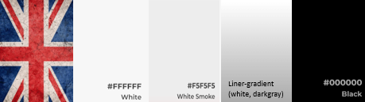

# London Landmark Memory Game 

London Landmark Memory Game, is a version of the 'classic card' memory game. The game has been designed using 16 flip cards and is suitable for any age of user from child to adult. Users are able to set themself a challange by playing over and over to see if they can beat their previous amount of moves taken and in a quicker time. 

## Demo
[To view the live website, click here](https://natalielockyer.github.io/London-Memory-Game)

# Contents
+ [User Experience]
  + [Key Project Goals]
  + [Target Audience]
  + [User Requirements and Expectations]
  + [User Stories]
  + [Wireframes]
  + [Design]
    + [Typography]
    + [Colour Scheme]
+ [Features]
  + [Existing Features]
  + [Future Features]
+ [Technologies Used]
  + [Languages Used]
  + [Frameworks Used]
+ [Testing]
  + [Validator Testing]
  + [Lighthouse Testing]
  + [Responsiveness]
  + [Full Testing ]
  + [Testing User Stories]
+ [Deployment and Local Deployment]
  + [Deployment]
  + [Local Deployment]
+ [Credits]
  + [Code]
  + [Media]
  + [Acknowledgements]

  ***
  ***
# User Experience

### Key Project Goals
  * To create an enjoyable interactive memory game with a London Landmark theme.
  * Create a game were the user initiates the timer by selecting their first two cards. 
  * Show that the user is making progress by adding their moves and time taken, to the win message.
  * Make it responsive on a number of different screen sizes.
  * Ensure the user is able to navigate easily.
  * Add links to social media if the user wants to learn/see more.

### Target Audience
  * Users of any age that would like to play an enjoyable and interactive card game. 
  * Users who wish to improve their memory skills
  * Users who like to visit London

### User Requirements and Expectations 
  * An accessible game that can be played on muliple size devices
  * A game that loads quickly on all devices and connections
  * A fun and interactive game that is appealing and well structured
  * Users are able to find instructions on how to play if they are not familiar with the game
  * A timer to start once the user has chosen thier first two cards
  * The ability to track the number of moves taken
  * The ability to see a timer with the time taken so far
  * Users to recieve feedback once the game is complete, including a winning message, the number of moves taken and time to find all the matching pairs and an option to play again. 
  * To be able to restart the game at any time throughout.
  
### User Stories
As a site visitor,

  * I am initially looking for an eye-catching and interactive game that I can play
  * I will see a large black heading telling me the name of the game
  * I can see a button on how to play the game, when clicked, a screen apprears with the game instructions
  * I can see two areas with 'Time' and 'Moves Taken', which will record the time and the amount of moves it takes to find all the matching pairs
  * I will see that when the first two cards are chosen the timer will start.
  * I will see that when the cards are not matching they flip back around
  * I will see that when the cards are matching they stay fixed on the screen 
  * I can see a button with 'restart current game' which can be clicked at any point and will restart the game. 
  * I will see that when all the matching pairs have been found, a screen appears with a winning message, the time and moves it has taken to find all the matching pairs, and an option to play again if I wish to do so. 
  * I am challanged by the timer and moves taken which makes me want to play again to see if I can beat my score. 
  * I can see links in the footer of the page which link to social media pages.

## Wireframes 

For my wireframs I used Balsamiq. On reflection from PP1, I added to much detail. For this wireframe, I stripped it right back and put minimal design detail. 
I created wireframs to show what the page would look like on a mobile phone, and Ipad/tablet and a laptop/computer

**************************** INSERT*************************

## Design 

### Typography
For my font I chose 'Shadow Into Light' which I imported from Google Fonts. I added letter spacing to my font to make the smaller text easier to read. 

### Colour Scheme

  As the colour of the cards are a mix of blue, red and white, I wanted to keep the surrounding area simple as not to over complicate it and ensure a positive user experience. 

