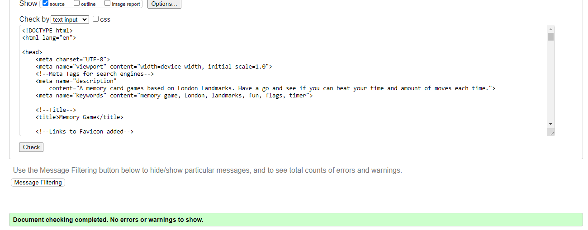

# [London Landmark Memory Game](#https://natalielockyer.github.io/London-Memory-Game)

London Landmark Memory Game, is a version of the 'classic card' memory game. The game has been designed using 16 flip cards and is suitable for any age of user from child to adult. Users are able to set themself a challange by playing over and over to see if they can beat their previous amount of moves taken and in a quicker time. 

## Demo
[To view the live website, click here](https://natalielockyer.github.io/London-Memory-Game)

# Contents
+ [User Experience](#user-experience)
  + [Key Project Goals](#key-project-goals)
  + [Target Audience](#target-audience)
  + [User Requirements and Expectations](#user-requirements-and-expectations)
  + [User Stories](#user-stories)
  + [Wireframes](#wireframes)
  + [Design](#design)
    + [Typography](#typography)
    + [Colour Scheme](#colour-scheme)
+ [Features](#features)
  + [Current Features](#current-features)
    + [Grid Game](#grid-game)
    + [Game Information](#game-information)
    + [Navigation Buttons](#navigation-buttons)
    + [How to Play Modal](#how-to-play-modal)
    + [Winning Modal](#winning-modal)
  + [Future Features](#future-features)
+ [Technologies Used](#technologies-used)
  + [Languages Used](#languages-used)
  + [Frameworks Used](#frameworks-used)
+ [Testing](#testing)
  + [Validator Testing](#validator-testing)
  + [Lighthouse Testing](#lighthouse-testing)
  + [Responsiveness](#responsiveness)
  + [Full Testing ](#full-testing)
 + [Deployment and Local Deployment](#deployment-and-local-deployment)
  + [Deployment](#deployment)
  + [Local Deployment](#local-deployment)
  + [How to Clone](#how-to-clone)
+ [Credits](#credits)
  + [Code](#code)
  + [Media](#media)
  + [Acknowledgements](#acknowledgements)

  ***
  ***

# User Experience

### Key Project Goals
  * To create an enjoyable interactive memory game with a London Landmark theme.
  * Create a game were the user initiates the timer by selecting their first two cards. 
  * Show that the user is making progress by adding their moves and time taken, to the win message.
  * Make it responsive on a number of different screen sizes.
  * Ensure the user is able to navigate easily.
  * Add links to social media if the user wants to learn/see more.

### Target Audience
  * Users of any age that would like to play an enjoyable and interactive card game. 
  * Users who wish to improve their memory skills
  * Users who like to visit London

### User Requirements and Expectations 
  * An accessible game that can be played on muliple size devices
  * A game that loads quickly on all devices and connections
  * A fun and interactive game that is appealing and well structured
  * Users are able to find instructions on how to play if they are not familiar with the game
  * A timer to start once the user has chosen thier first two cards
  * The ability to track the number of moves taken
  * The ability to see a timer with the time taken so far
  * Users to recieve feedback once the game is complete, including a winning message, the number of moves taken and time to find all the matching pairs and an option to play again. 
  * To be able to restart the game at any time throughout.
  
### User Stories
As a site visitor,

  * I am initially looking for an eye-catching and interactive game that I can play
  * I will see a large black heading telling me the name of the game
  * I can see a button on how to play the game, when clicked, a screen apprears with the game instructions
  * I can see two areas with 'Time' and 'Moves Taken', which will record the time and the amount of moves it takes to find all the matching pairs
  * I will see that when the first two cards are chosen the timer will start.
  * I will see that when the cards are not matching they flip back around
  * I will see that when the cards are matching they stay fixed on the screen 
  * I can see a button with 'restart current game' which can be clicked at any point and will restart the game. 
  * I will see that when all the matching pairs have been found, a screen appears with a winning message, the time and moves it has taken to find all the matching pairs, and an option to play again if I wish to do so. 
  * I am challanged by the timer and moves taken which makes me want to play again to see if I can beat my score. 
  * I can see links in the footer of the page which link to social media pages.

## Wireframes 

For my wireframs I used Balsamiq. On reflection from PP1, I added to much detail. For this wireframe, I stripped it right back and put minimal design detail. 
I created wireframs to show what the page would look like on a mobile phone, and Ipad/tablet and a laptop/computer

## Design 

### Typography
For my font I chose 'Shadow Into Light' which I imported from Google Fonts. I added letter spacing to my font to make the smaller text easier to read. 

### Colour Scheme

  As the colour of the cards are a mix of blue, red and white, I wanted to keep the surrounding area simple as not to over complicate it and ensure a positive user experience. 

# Features

## Current Features

### Grid Game 
For the layout of this game I have used a 4x4 square grid which has a total of 16 cards. This is the maximum number of cards I wanted to use and felt anymore would look squashed on a smaller device. With the theme being London Landscapes, I chose to use the Union Jack as the back of the playing card. 

### Game Information 
The 'timer' is on the left side, when the user has chosen their first two cards the timer will begin. 
The 'moves taken' is on the right side, when the user makes a selection and the cards do not match the moves taken counter will start to add up. 

### Navigation Buttons 
I have chosen to have two navigation buttons on the page. The 'how to play' button, when pressed will show a modal box with the instructions of how to play the game.
The 'reset current game' when pressed will allow the user to restart the game at any time they wish.

### How to play Modal 
When the 'How to Play' button is clicked the modal will appear on the screen. To keep with the styling of the page, I have used a whitesmoke background colour with black text to make it stand out. There is an 'X' in the top right corner which allows the user to close the modal down and continue with the game. This modal can be clicked at any point throughtout the game if the user needs to re-visit it. 

### Winning Modal 
When the user has correctly matched all of the cards, the 'Winning Modal' will appear on the screen. As before, this is in keeping with the style of the page and is the same design as the how to play modal. 
The user will see a message to congratulate them on finding all the matching cards. They will also see the total number of moves and the time it has taken them to complete the game. There is also a 'Play Again' on-click, which will restart the game if the user wants to play again. 

## Future Features
In the future I would like to add the following features

* I would like to add a username section
* I would like to add sounds when the user gets a match, and a sound when the winning modal appears.
* I would like to add a button so that the user can mute the sounds if they wish too.
* I would like to add a leader board were the users score would appear. 
* I would like the leaderboard to be open, so you can compete against other users. 

# Technologies Used

## Languages Used 
HTML - This was used to create the basics of the webpage
CSS - This was used to style and create the look of the webpage/game.
JavaScript - This was used to create the logic for the game and to manipulate the HTML and CSS on the page.

## Frameworks Used
[Balsamic](https://balsamiq.com/) - This was used to create the wireframes for the initial development
[Google Fonts](https://fonts.google.com/) - I used this website to import the font-family (Shadow into Light) for the page.
[Google Chrome Development Tools](https://developer.chrome.com/docs/devtools/) - This was used to test the page on a variety of different sized devices. I also used this to try out different styles without the need to constantly change them live. 
[Lighthouse](https://developer.chrome.com/docs/lighthouse/overview/) - This was used to test the accessibility and speed of the page.
[GitHub](https://github.com/) - This was used to create the initial respository.
[GitPod](https://gitpod.io/workspaces) - This was used to develop the project
[GitHub Pages](https://github.com/NatalieLockyer/London-Memory-Game/deployments) - This was used to deploy the site
[Validator](https://validator.w3.org/) - This was used to check for any errors in my HTML and CSS code
[Beautify Tool]() - This was used to 'beautify' my Javascript code

# Testing

  ## Validator Testing
  I used the W3C Validator to validate the HTML and CSS on my page. The results are as follows:

  * Index.html Page

  

  
  

  * Style.css Page

  

  
  

  ## Lighthouse Testing
  TBC

  ## Responsiveness
  TBC

  ## Full Testing 

| Feature      | Expected Outcome | Testing Performed    | Result | Pass or Fail |
|   :---       |      :----:      |        :----:        | :----: |    :----:    |
| Home Page      |                  |                      |        |              |
| How to Play Button  | When clicked   a modal will   appear with the   game instructions | Clicked button | Modal Opened    | Pass        |
| X - to close modal  | When clicked   the modal   will close   | Clicked X | Modal closed   | Pass        |
| Timer | When the first two   cards are selected   the timer will start   | two cards clicked | Timer started   | Pass        |
| Moves Taken | When the user   selects two cards   that are not a match,   the moves taken will   go up.| Cards are not a match | Moves taken goes to 1  | Pass        |
| Flip cards | When the user   selects a card   it will flip over | Card clicked | Card flips | Pass        |
| Matching Pair   stay locked on screen | When the user   selects two  matching cards   they will lock in place | Cards are a match | Cards stay locked on screen | Pass        |

 # Deployment and Local Deployment
  
## Deployment
  * Login to Github
  * Open the repository
  * Navigate to the settings tab
  * Click on 'Pages' in the left hand column
  * Under 'Source' select 'Deploy from branch'
  * Under 'Branch' select 'main', 'root' and save. This step may take a little time to  process.
  * Once completed, the URL will appear above 'source'.

## Local Deployment
  How to Fork 
  * Login to Github
  * Open repository
  * Click fork button in the top right corner.

## How to clone 
  * Login to Github
  * Open repository 
  * Click on the 'code' button, select which you would like with HTTPS, SSH or GitHib CLI and copy
  * Open terminal in code editor and change the current directory to the location you want to use is
  * Type 'git clone' and paste link that you copied in step 3, press enter

 # Credits

  ## Code
  TBC
  ## Media
  TBC
  ## Acknowledgements
  TBC

